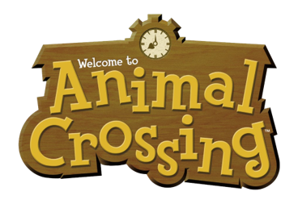
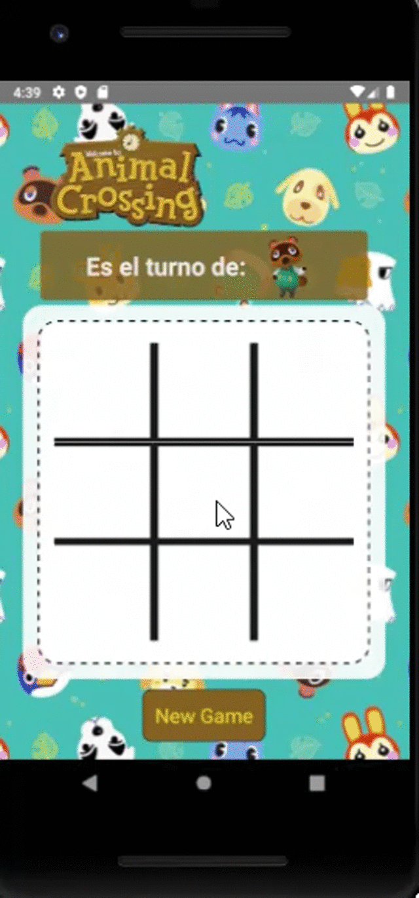

## Definición del producto 

El tres en línea, también conocido como la vieja, Tic-Tac-Toe, juego del gato, etc...es un juego de lápiz y papel entre dos jugadores: O y X, los cuales marcan un espacio del tablero 3×3 hasta completar una fila de 3 consecutivos.

## Usuario Objetivo

Nuestro público objetivo son niños en edad pre-escolar, es por esto que el diseño del juego es ilustrativo, intuitivo y educativo, con botones grandes y poco o nada de texto.

Está basado en _Animal Crossing_, la famosa serie de videojuegos publicado por Nintendo en 2001 y una nueva edición en marzo de 2020. El juego consiste en vivir en un pueblo habitado por animales antropomórficos, llevando a cabo diversas actividades.

## Herramientas de desarrollo

Este proyecto fue construido con React Native la cual es una herramienta que nos permite construir aplicaciones nativas para Android e iOS usando JavaScript y React.

# Diseño UI 
## Jugadores
### Tom Nook 

### Isabelle 

## Ejemplo de uso 

